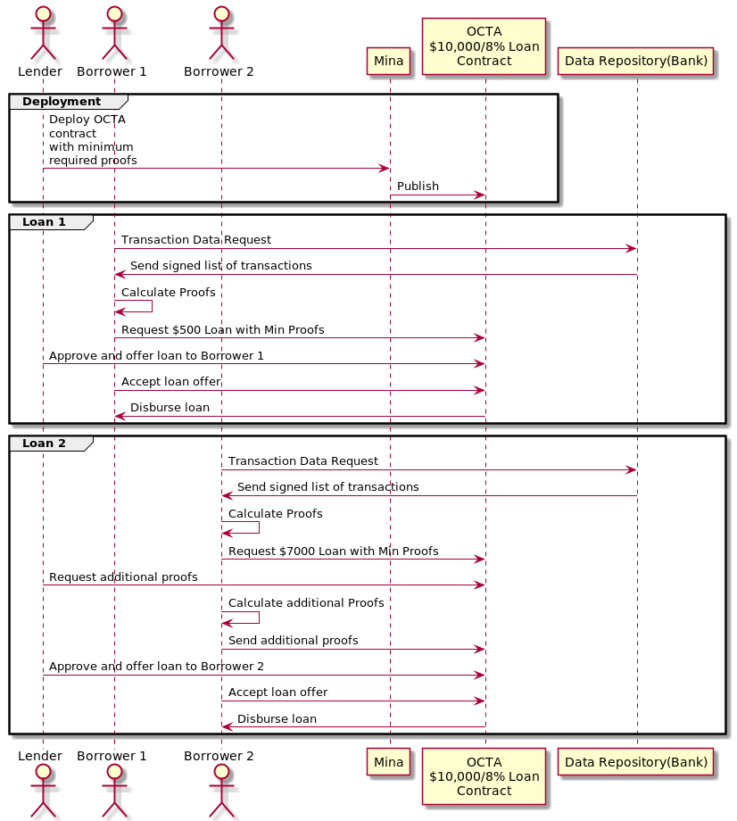
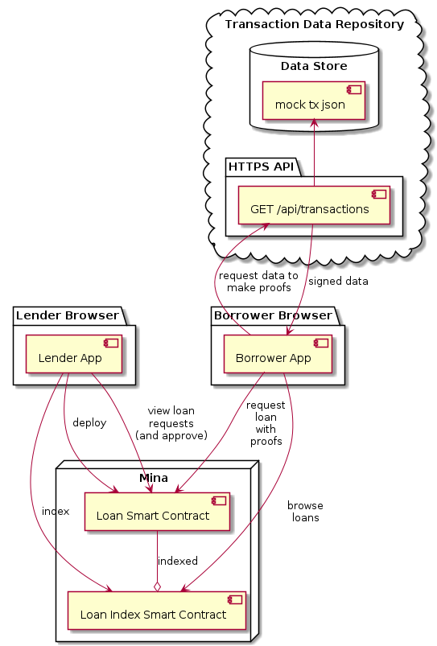
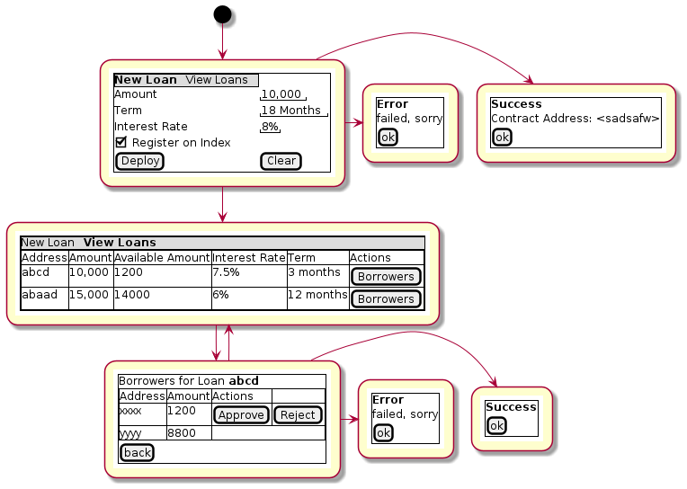
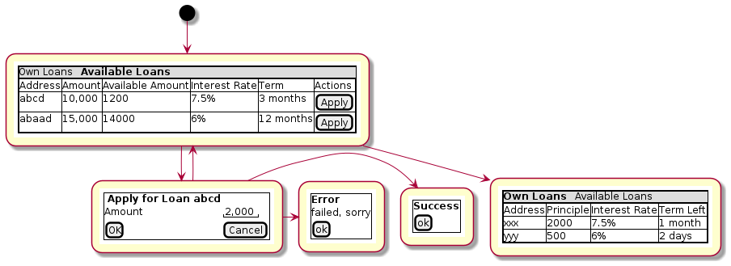

Off Chain Transaction Analytics System Prototype
================================================

Table of Contents

-   [1. Abstract](#_abstract)
-   [2. Background](#_background)
-   [3. Use Cases/ Requirements](#_use_cases_requirements)
    -   [3.1. Expected Workflow](#_expected_workflow)
-   [4. Method](#_method)
    -   [4.1. Proposed Prototype System
        Overview](#_proposed_prototype_system_overview)
    -   [4.2. Interface: Loan Index Smart Contract
        (LISC)](#_interface_loan_index_smart_contract_lisc)
    -   [4.3. Interface: Loan Smart Contract
        (LSC)](#_interface_loan_smart_contract_lsc)
        -   [4.3.1. TransactionDataProofs](#_transactiondataproofs)
    -   [4.4. Component: Transaction Data
        Repository](#_component_transaction_data_repository)
        -   [4.4.1. Component: HTTPS API](#_component_https_api)
            -   [Calculating the Signature](#_calculating_the_signature)
        -   [4.4.2. Component: Data Store](#_component_data_store)
    -   [4.5. Component: Lender App](#_component_lender_app)
    -   [4.6. Component: Borrower App](#_component_borrower_app)
        -   [4.6.1. Algorithm: Apply for a
            Loan](#_algorithm_apply_for_a_loan)
-   [5. Implementation](#_implementation)

Document Metadata

-   **Status:** DRAFT

-   **Scope:** Internal

-   **Changelog:**

    -   v.0.0.1

        -   Abstract, Background and initial parts of Method added.

## 1. Abstract

Off Chain Transaction Analytics(OCTA) system prototype is a proof of
concept system that provides an off-chain transaction analytics system
(OCTA for short) using Mina Snapps smart contracts. The motivation of it
is to provide a way for the users to protect their sensitive financial
data without exposing it to a third party while also gaining access to
critical financial services such as credit. Such a system, with the aid
of zk-SNARK technology, would allow one to prove one’s own financial
standing using their verified transaction history records without the
need of any centralized party’s approval. The prototype would provide a
basic protocol and a set of tools for all the actors: lenders, borrowers
and financial data repositories. We also aim to provide example
use-cases such as proving a borrower’s average income over a requested
period of time by a lender. Those examples would demonstrate how MINA
Snapps could affect daily interactions involving financial data
improving their security and privacy.

## 2. Background

A person’s financial transaction history is one of the most important
and private aspects of their lives. A third party gaining access to this
information could in theory understand a person’s social/financial
standing, inter-personal relationships and even health. As for now, many
aspects of the present financial system is built on users voluntarily
handing over this information in exchange for granting access to
critical financial services. It often occurs without them being aware of
the benefits the third party acquires from their data. This leads to a
breach of privacy that could possibly lead to exposing this sensitive
data to unintended parties. Eg:

-   All non-collateralized lending systems require some form of
    transaction history analysis/verification to understand the
    borrower’s financial standing. Most common way to do achieve this at
    the moment is through a personal credit score that is provided by a
    centralized entity that tracks the transactional habits between all
    the parties. This caused [massive data
    breaches](https://en.wikipedia.org/wiki/2017_Equifax_data_breach) in
    the past.

-   Rewards systems such as credit card cashback schemes require
    explicitly access to one’s raw transaction history by a third party.

-   Mobile payment wallets such as Google Pay could mine a user’s
    transaction history data to provide a more personalized shopping
    experience.

To face this problem, Mina Snapps have potential to provide a solution
that preserves user’s privacy without compromising the access to
critical financial services. In our scheme, this is achieved using
off-chain verifiable computation with aid of ZK-Snarks. This manuscript
is a brief introduction to this idea, with potential use-cases,
requirements and a draft of an architecture for a prototype Off-Chain
Transaction Analytics system powered by MINA Snapps.

## 3. Use Cases/ Requirements

Following are some simplified use cases for the prototype.

1.  As a lender I’m able to register in the system as being able to lend
    out a certain amount with a certain interest rate.

2.  As a borrower I want to be able to view lenders(potential loans)
    registered on the system.

3.  As a borrower I want to be able to request a loan from a lender
    registered on the system.

4.  As a lender I want to be able to request a potential borrower to
    prove their regular income to be more than a certain amount(referred
    to as the *Regular Income Proof*) using their bank transaction
    records.

5.  As a lender I want to be able to request a potential borrower to
    prove their average monthly balance to be more than a certain
    amount(Referred to as the *Average Monthly Balance Proof*) using
    their bank account balance and/or transactions.

6.  As a borrower I want to be able to provide a Regular Income Proof
    without exposing my bank transaction history to the lender.

7.  As a borrower I want to be able to provide an Average Monthly
    Balance Proof without exposing my bank transaction history to the
    lender.

8.  As a lender I want to be able to verify the source of a Regular
    Income Proof as coming from the borrower’s bank.

9.  As a lender I want to be able to verify the source of an Average
    Monthly Balance Proof as coming from the borrower’s bank.

10. As a lender I want to be able to verify a Regular Income Proof.

11. As a lender I want to be able to verify an Average Monthly Balance
    Proof.

12. As a lender I want to be able to approve and make a loan offer if
    the required transaction activity proofs are satisfied.

13. As a borrower I’m able to accept a loan offer if the conditions are
    agreeable, and receive the requested funds.

14. \[Optional\] As a Snapp developer I want to be able to write a Snapp
    that is capable of applying for loans using OCTA protocol

15. \[Optional\] As a Snapp developer I want to be able to write a Snapp
    that is capable of offering loans using OCTA protocol

### 3.1. Expected Workflow

## 4. Method

### 4.1. Proposed Prototype System Overview

### 4.2. Interface: Loan Index Smart Contract (LISC)

A simple smart contract that holds the account addresses of the
currently published loan smart contracts in the system. The use of this
is for the borrowers to be able to browse and see details of the
available loan contracts in the system.

TODO: Specify interface.

### 4.3. Interface: Loan Smart Contract (LSC)

The main smart contract for handling the business logic of the
lender-borrower interactions. The interface would look like the
following.

    // Loan smart contract interface
    class Loan extends SmartContract {
      @state(Field) interestRate: State<Field>;
      @state(Field) termInDays: State<Field>;

      // Terms of the loan are injected at construction. Called by the lender.
      constructor(
        loanAmount: UInt64,
        interestRate: Field;
        termInDays: Field;
        address: PublicKey,
        requiredProofs: RequiredProofs (1)
      ) {
        super(address);
        this.balance.addInPlace(loanAmount);
        this.interestRate = State.init(interestRate);
        this.termInDays = State.init(termInDays);
      }

      // Request a loan with required proofs. Called by the borrower
      @method async requestLoan(amount: UInt64, proofs: TransactionDataProofs) { (2)
        (3)
      }

      // Approve the loan for the given address. Called by the lender.
      // This would be useful when lenders optimize on the type of borrowers
      // based on the demand and other factors.
      @method async approve(address: PublicKey) {
      }

      // Accept the loan for the calling address. Called by the borrower.
      @method async accept() {
      }

    }

1.  RequiredProofs data structure needs to be defined based on further
    research. Most probably an extension of CircuitValue class.

2.  TransactionDataProofs is a
    [proofSystem](https://github.com/o1-labs/snarkyjs/blob/2a8f64a764917d53fd5fa5e807d7159f89f47545/src/examples/wip.ts#L101)
    that need to be defined based on further research.

3.  Verify proofs. Then at the initial phase possibly disburse the loan.
    Later an approval method would be implemented together with support
    for accepting the loan by the borrower to disburse the loan.

#### 4.3.1. TransactionDataProofs

This is a new
[proofSystem](https://github.com/o1-labs/snarkyjs/blob/2a8f64a764917d53fd5fa5e807d7159f89f47545/src/examples/wip.ts#L101)
for transaction statistics based on off chain transaction data. It also
needs to index the proofs it’s provided to be able to be verified based
on the `requireProofs` field of the LSC.

TODO R&D

### 4.4. Component: Transaction Data Repository

This is a separate service representing a transaction storage backend
for example of a bank. Proposed to be implemented as a nodejs
application.

#### 4.4.1. Component: HTTPS API

A REST API that received requests and provides signed transactions
data(stored in it’s database) in return. Signature scheme could follow
the same as [what is used by
Mina](https://github.com/MinaProtocol/mina/blob/develop/docs/specs/signatures/description.md).
Further details should be specified with research. For example the way
to convert to fields, sign and prove parts of the transactions that are
strings. A possible approach is using a merkle tree. The data format
sent of over the wire could possibly use [Google
Protobuf](https://developers.google.com/protocol-buffers).

Endpoint format,

-   **HTTPS GET /api/transactions**

-   **Headers**

    -   x-signature: Signature for the payload

-   **Body** format of the output would follow,

        {
          "id": "id of the account",
          "balance": "latest available balance of the account",
          "timestamp": "timestamp when retrieved",
          "transactions": [
            {
              "id": "id of the transaction",
              "amount": "amount",
              "sendingAccount": {},
              "receivingAccount": {},
              "type": "type of the transaction",
              "description": "description",
              "timestamp": "date of the transaction"
            }
          ]

        }

##### Calculating the Signature

TODO R&D

#### 4.4.2. Component: Data Store

This is a mock database of transactions stored as a json file based on
the transaction format described above.

### 4.5. Component: Lender App

The Lender App serves as the user interface for lenders for performing
the following actions,

1.  Deploy new LSC to Mina.

2.  Register the LSC on LISC (index).

3.  View loans deployed.

4.  View loan requests.

5.  Approve loan requests.

The flow outlined is proposed to be built as typescript/react app
integrated with snarkyjs.

### 4.6. Component: Borrower App

The Borrower App serves as the user interface for borrowers for
performing the following actions.

1.  Browse available loans

2.  Apply for a loan.

3.  Accept a loan.

4.  Browse already borrowed loans.

#### 4.6.1. Algorithm: Apply for a Loan

Applying for a loan involves the invocation of `LSC.requestLoan` method
with calculated required proofs.

TODO R&D

## 5. Implementation

1.  TODO milestones etc. key results

Last updated 2022-01-23 19:56:03 +0100
