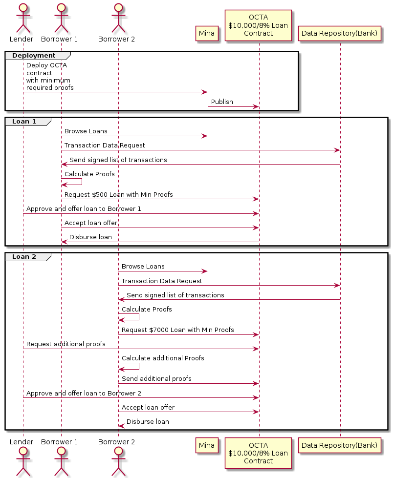

# Off Chain Transaction Analytics System Prototype

## Abstract

Off Chain Transaction Analytics(OCTA) system prototype is a proof of concept system that provides an off-chain transaction analytics system (OCTA for short) using Mina Snapps smart contracts. The motivation of it is to provide a way for the users to protect their sensitive financial data without exposing it to a third party while also gaining access to critical financial services such as credit. Such a system, with the aid of zk-SNARK technology, would allow one to prove one's own financial standing using their verified transaction history records without the need of any centralized party's approval. The prototype would provide a basic protocol and a set of tools for all the actors: lenders, borrowers and financial data repositories. We also aim to provide example use-cases such as proving a borrower's average income over a requested period of time by a lender. Those examples would demonstrate how MINA Snapps could affect daily interactions involving financial data improving their security and privacy.

## Background

A person's financial transaction history is one of the most important and private aspects of their lives. A party gaining access to this information could in theory understand a person's social/financial standing, inter-personal relationships and even health. But some parts of the present financial system is built on users readily handing over this information in exchange for critical financial services or even worse without them even knowing or benefiting from it. This leads to a breach of privacy as well as possibly exposing this data to unintended parties. Eg:

- All non-collateralized lending systems require some form of transaction history analysis/verification to understand the borrower's financial standing. Most common way to do achieve this at the moment is through a personal credit score that's provided by a centralized entity that tracks the transactional habits. This has lead to [massive data breaches](https://en.wikipedia.org/wiki/2017_Equifax_data_breach) in the past.
- Rewards systems such as credit card cashback schemes require access to a person's transactions by third parties.
- Mobile payment wallets such as Google Pay could mine a person's transaction history data in order to provide a more personalized shopping experience.

Mina Snapps provide a way to preserve privacy while also giving access to critical financial services to users by using off-chain verifiable computation through the use of ZK Snarks. This document intends to layout the possible use-cases, requirements and an architecture for a prototype Off-Chain Transaction Analytics System based on Snapps.

## Use Cases/ Requirements

Following are some simplified use cases for the prototype.

- As a lender I'm able to register in the system as being able to lend out a certain amount with a certain interest rate.
- As a borrower I want to be able to request a loan from a lender registered on the system.
- As a lender I want to be able to request a potential borrower to prove their regular income to be more than a certain amount(referred to as the _Regular Income Proof_) using their bank transaction records.
- As a lender I want to be able to request a potential borrower to prove their average monthly balance to be more than a certain amount(Referred to as the _Average Monthly Balance Proof_) using their bank account balance and/or transactions.
- As a borrower I want to be able to provide a Regular Income Proof without exposing my bank transaction history to the lender.
- As a borrower I want to be able to provide an Average Monthly Balance Proof without exposing my bank transaction history to the lender.
- As a lender I want to be able to verify the source of a Regular Income Proof as coming from the borrower's bank.
- As a lender I want to be able to verify the source of an Average Monthly Balance Proof as coming from the borrower's bank.
- As a lender I want to be able to verify a Regular Income Proof.
- As a lender I want to be able to verify an Average Monthly Balance Proof.
- As a lender I want to be able to approve and make a loan offer if the required transaction activity proofs are satisfied.
- As a borrower I'm able to accept a loan offer if the conditions are agreeable, and receive the requested funds.

### Expected Workflow

## Method

### Solution Analysis

### Proposed Solution

## Implementation

.. TODO milestones etc. key results

